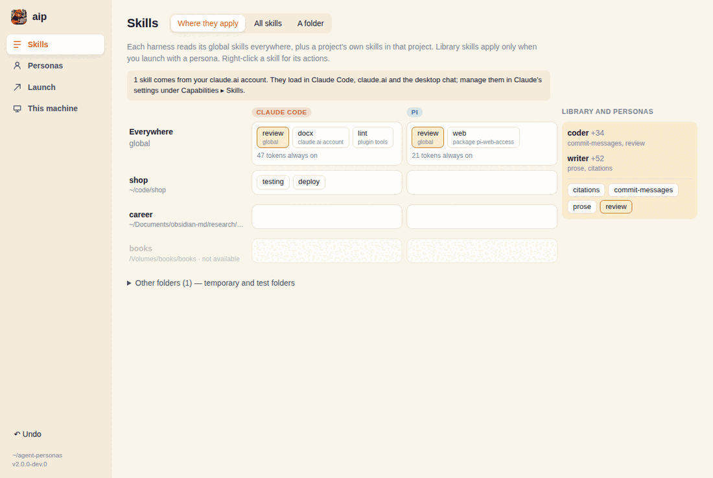
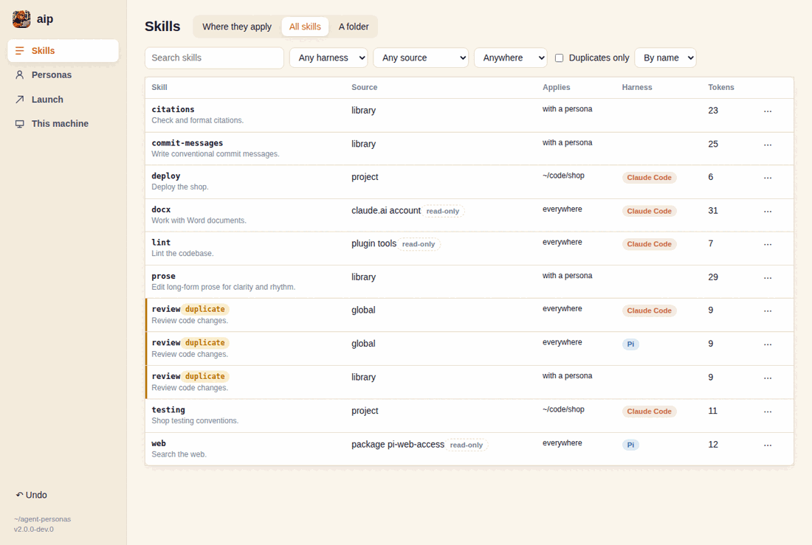
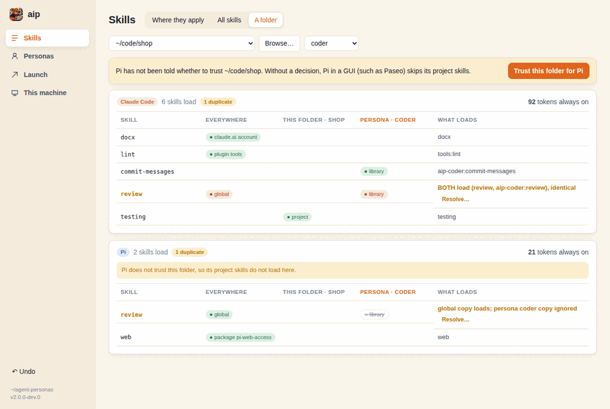
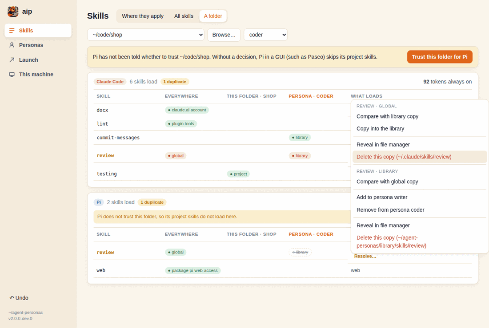
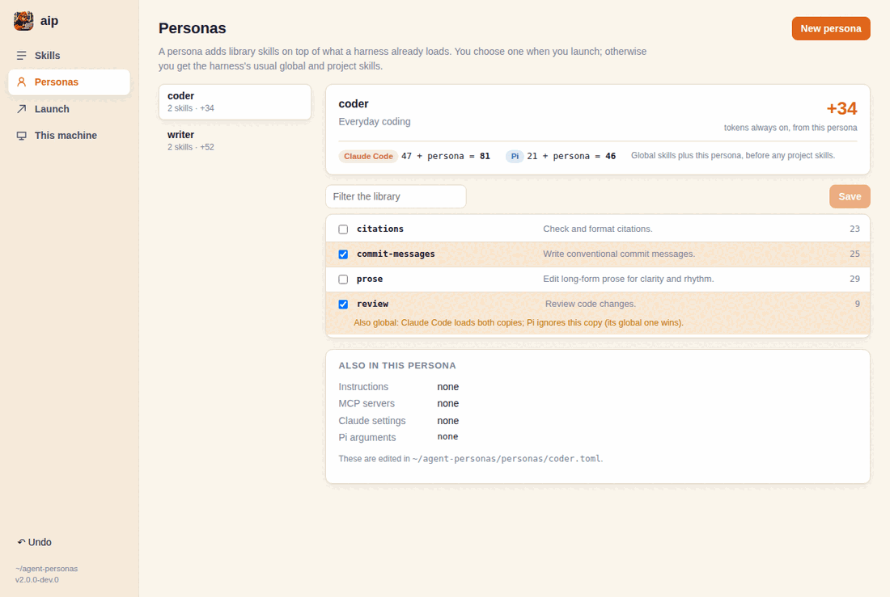
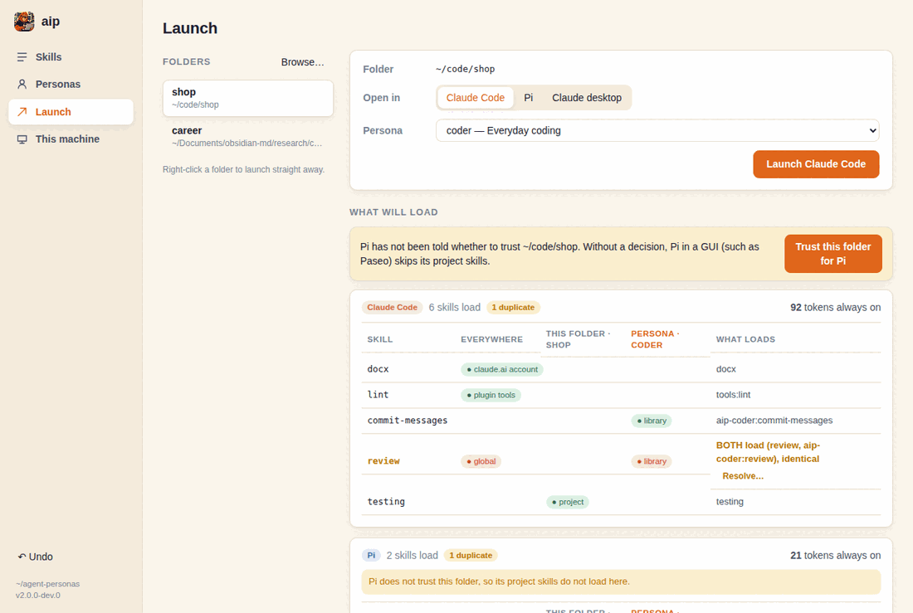
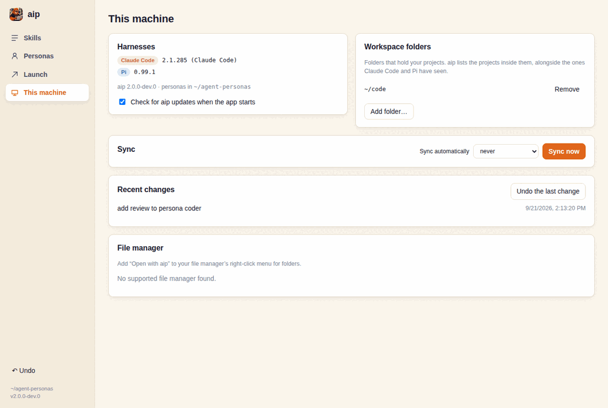
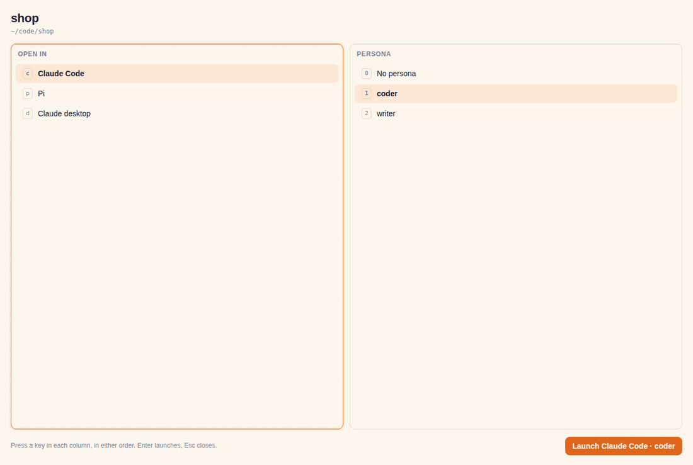

# aip 2 app: screens (for review)

These are the app's screens as built, rendered from the fixture backend in
`ui/src/lib/mock.js` (`npm --prefix ui run dev` shows the same thing in a
browser). Task T54 asks for the maintainer to approve them before the design
is considered settled: **approval pending**. Comment on anything here, or try
the real thing with your own skills (see [Running the app](#running-the-app)).

The fixture is a small machine: a global `review` skill in both harnesses, a
claude.ai account skill, a Claude plugin skill, a Pi package skill, a project
(`~/code/shop`) with two Claude skills, and two personas, `coder` and
`writer`. `coder` adds a `review` too, so it shows how duplicates look.

## Skills ▸ Where they apply



One lane per harness. "Everywhere" is the global layer; each project below it
shows its own skills. The library and personas sit alongside, because they
apply only when you launch with a persona. Amber skills have a copy elsewhere.
Click or right-click any skill for its actions. Temporary and test folders are
folded away under "Other folders". Unavailable folders (an unmounted volume)
are greyed.

## Skills ▸ All skills



Every copy of every skill, with search and filters by harness, source, scope
and duplicates, sorted by name or by always-on cost. Read-only copies (account,
plugin, package) are marked; they can be compared or copied into the library,
not deleted.

## Skills ▸ A folder (the launch preview)



What each harness actually loads in one folder, layer by layer, with or
without a persona, and the always-on token total. Here Claude Code loads both
`review` copies (the persona's is namespaced as `aip-coder:review`), while Pi
keeps its global copy and ignores the persona's. The banner offers to trust
the folder for Pi, because a Pi GUI skips project skills in folders Pi has not
been told to trust.



"Resolve…" on a flagged row lists the actions for each copy: compare, copy
into the library, add to or remove from a persona, reveal, delete. Every change
shows exactly what will happen and applies only on confirmation; Undo (bottom
left, or This machine ▸ Recent changes) reverses it.

## Personas



Tick library skills; the always-on budget updates as you go, per harness
(global skills plus the persona). A skill that is also global gets a note on
what each harness will do with the two copies. Save writes only the `skills`
list in the persona's TOML file, keeping comments and layout, as one undoable
change. Instructions, MCP servers, Claude settings and Pi arguments are shown
but edited in the file.

## Launch



Choose a folder (recent launches first, then known projects, or Browse…),
where to open it (Claude Code, Pi, or the Claude desktop app) and a persona,
see the preview, and launch. Right-click a folder to launch straight away:
recent combinations first, then harness ▸ persona.

## This machine



Harness versions, the update-check setting, workspace folders, sync (with an
opt-in timer and a side-by-side conflict view), the history of changes with
Undo, and the file-manager integrations from Phase 6.

## The picker



The small window that `aip pick DIR`, `aip://pick?dir=…` and the file-manager
menus open. Keyboard only, in either order: `c`/`p`/`d` choose Claude Code,
Pi or Claude desktop; `0`–`9` choose a persona; once both are chosen it
launches. Arrows and Enter work too; Esc closes. It starts on the last choice
used in that folder.

## Running the app

From the repository:

```sh
npm --prefix ui ci && npm --prefix ui run build
cargo run -p aip-app --features custom-protocol          # the app
cargo run -p aip-app --features custom-protocol -- pick ~/code/shop
```

For UI work with hot reload, run `npm --prefix ui run dev` in one terminal
and `cargo run -p aip-app` (no feature) in another.

- **Blank or flickering window on Linux** (some GPU and driver combinations
  with WebKitGTK): start it with `WEBKIT_DISABLE_DMABUF_RENDERER=1`.
- **Tracing:** `AIP_DEBUG=1` prints start-up and hand-over steps to stderr.
- **CI:** `ci/scripts/app-smoke.sh` runs the window under Xvfb, checks that the
  app binary answers CLI commands, and opens the picker through
  `xdg-open 'aip://pick?dir=…'`.
